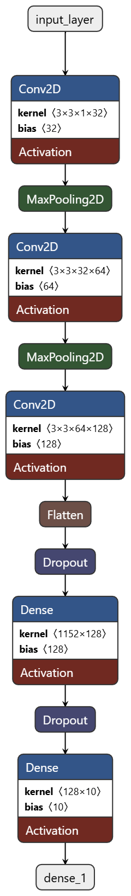
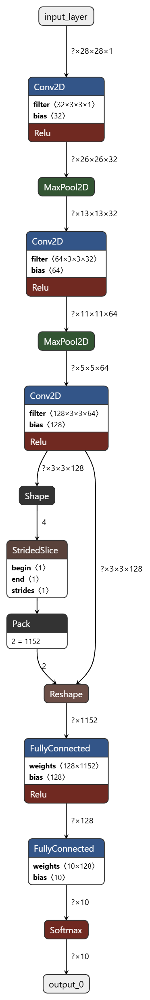

# Processo Seletivo – Intensivo Maker | AI

Bem-vindo(a) à **etapa prática do processo seletivo para o Intensivo Maker**.

Esta atividade tem como objetivo avaliar competências técnicas relacionadas a **Machine Learning**, **Visão Computacional** e **Otimização de modelos para sistemas embarcados (Edge AI)**, a partir da aplicação prática dos conhecimentos adquiridos nos cursos EAD da etapa anterior.

> 🎯 **Importante**  
> O foco deste desafio é avaliar sua capacidade de **projetar, treinar e otimizar um modelo de IA**.  

---

## 📌 Navegação Rápida

- 🏁 [Passo 0 – Antes de Tudo](#-passo-0-antes-de-tudo)
- ⚙ [Passo 1 – Preparando o Ambiente](#-passo-1-preparando-o-ambiente)
- 💻 [Passo 2 – O Desafio Técnico](#-passo-2-o-desafio-técnico)
  - 🎯 [Conjunto de Dados](#-conjunto-de-dados)
  - 📂 [Estrutura do Projeto](#-estrutura-do-projeto)
  - 📚 [Material de Apoio](#-material-de-apoio)
  - ⚖️ [Critérios de Avaliação](#️-critérios-de-avaliação)
- 📤 [Passo 3 – Instruções de Entrega](#-passo-3-instruções-de-entrega)
  - 📝 [Relatório do Candidato](#-relatório-do-candidato)
  - ⭐ [Diferencial Implementado](#-diferencial-implementado)

---

## 🏁 Passo 0: Antes de Tudo

Caso você **nunca tenha utilizado Git ou GitHub**, não se preocupe.  
Siga atentamente as etapas abaixo.


### 1️⃣ Criação de Conta no GitHub

1. Acesse: https://github.com  
2. Clique em **Sign up**  
3. Crie sua conta gratuita seguindo as instruções da plataforma  

(*O GitHub será utilizado para envio, versionamento e correção automática do seu projeto.*)


### 2️⃣ Instalação do Git

O **Git** é a ferramenta que permite versionar e enviar seu código para o GitHub.

- **Windows**  
  Baixe e instale o **Git Bash**:  
  https://git-scm.com/downloads

- **Linux / macOS**  
  Verifique se o Git já está instalado:
  ```bash
  git --version
  ```

---

## ⚙ Passo 1: Preparando o Ambiente

Para desenvolver o desafio, você deverá criar uma cópia deste repositório.

### 1️⃣ Fork do Repositório


1. No canto superior direito desta página, clique em **Fork**  
2. Uma cópia deste repositório será criada no **seu perfil do GitHub**
(*O Fork permite que você trabalhe de forma independente sem alterar o repositório original.*)


### 2️⃣ Clone do Repositório


No repositório do **seu Fork**, clique em **<> Code**, copie a URL e execute:

```bash
git clone https://github.com/SEU_USUARIO/nome-do-repositorio.git
cd nome-do-repositorio
```
(*O comando `git clone` cria uma cópia do repositório.*)


### 3️⃣ Preparação do Ambiente de Execução

Você pode executar o projeto de **Três formas**. Escolha apenas uma.


#### Opção A – Ambiente Python Local 
Requisitos:
- Python **3.10 ou 3.11**
- pip

Instale as dependências com:

```bash
pip install -r requirements.txt
```


#### Opção B – Dev Container 
Este repositório inclui um **Dev Container** para facilitar a criação de um ambiente Python padronizado.

**Requisitos**
- VS Code
- Docker instalado
- Extensão **Dev Containers**

**Passos**
1. Abra o repositório no VS Code  
2. Selecione **"Reopen in Container"**  
3. Aguarde a criação automática do ambiente  

➡️ As dependências serão instaladas automaticamente.


#### Opção C - via browser
Você também pode abrir o container via github codespace

1. Clique em **<> Code**
2. Clique em **Codespaces**
3. Clique em **Create codespace on image**


>  Será aberto uma instância do VS Code no seu navegador com o container configurado


---

## 💻 Passo 2: O Desafio Técnico

O desafio consiste em desenvolver um **modelo de Visão Computacional** capaz de **classificar dígitos manuscritos**, e posteriormente **otimizá-lo para execução em dispositivos Edge**, como sistemas embarcados e IoT.

O foco não é apenas obter alta acurácia, mas também **compreender o fluxo completo**:

**treinamento → salvamento → conversão → otimização**


### 🎯 Conjunto de Dados

Será utilizado o dataset **MNIST**, composto por imagens de dígitos manuscritos de **0 a 9**.


✔️ O dataset já está disponível na biblioteca **TensorFlow/Keras**, não sendo necessário download manual.

📌 *O MNIST é amplamente utilizado para introdução à Visão Computacional e Redes Neurais.*


###  ✅ Requisitos Obrigatórios

**Etapa 1:**  Treinamento do Modelo (`train_model.py`)

Implemente no arquivo `train_model.py` um código que realize:

- Carregamento do dataset MNIST via TensorFlow
- Construção e treinamento de um modelo de classificação baseado em **Redes Neurais Convolucionais (CNN)**  
  (utilizando camadas `Conv2D` e `MaxPooling`)
- Treinamento do modelo
- Exibição da **acurácia final** no terminal
- Salvamento do modelo treinado no formato **Keras** (`.h5`)

(*O modelo salvo será utilizado na etapa de otimização.*)


**Etapa 2:** Otimização do Modelo (`optimize_model.py`)

No arquivo `optimize_model.py`, implemente:

- Carregamento do modelo treinado
- Conversão para **TensorFlow Lite (`.tflite`)**
- Aplicação de técnica de otimização, como:
  - **Dynamic Range Quantization**

(**Objetivo:** reduzir o tamanho do modelo, mantendo desempenho adequado para aplicações de **Edge AI**.)


### 📂 Estrutura do Projeto

⚠️ **Atenção:**  
A estrutura e os nomes dos arquivos **não devem ser alterados**.

```plaintext
seu-repositorio/
├── .github/
│   └── workflows/
│       └── ci.yml            # 🤖 Pipeline de correção automática (NÃO ALTERAR)
├── .devcontainer/            # 🐳 Dev Container (opcional)
│   └── devcontainer.json
├── train_model.py            # ✏️ Treinamento do modelo
├── optimize_model.py         # ✏️ Conversão e otimização
├── requirements.txt          # 📄 Dependências do projeto
├── model.h5                  # 🤖 Modelo treinado (gerado)
├── model.tflite              # ⚡ Modelo otimizado (gerado)
└── README.md                 # 📝 Relatório final do candidato
```


### ⚠️ Restrições e Considerações de Engenharia

Este desafio é avaliado automaticamente por meio de um pipeline de
**integração contínua (CI)**, executado em um ambiente controlado e com
restrições de recursos computacionais.

Você **não precisa conhecer GitHub Actions** para realizar o desafio.
No entanto, é importante respeitar as diretrizes abaixo.

**Diretrizes para o Modelo**

- O modelo deve ser uma **CNN simples**, adequada para **Edge AI**
- Evite arquiteturas muito profundas ou complexas
- Recomenda-se utilizar **até 3 camadas convolucionais**
- **Não utilize modelos pré-treinados**
- Número de épocas **limitado** (ex: até 5)

#### Diretrizes de Execução

- Treinamento apenas em **CPU**
- Tempo total reduzido (compatível com CI)
- Código deve executar do início ao fim **sem intervenção manual**

> **Importante:**  
> O objetivo não é obter a maior acurácia possível, mas sim demonstrar
> **engenharia eficiente**, compatível com ambientes automatizados e
> restrições típicas de aplicações reais de Edge AI.


### 📚 Material de Apoio

Os cursos realizados na etapa anterior **devem ser utilizados como referência**.

- 📘 **Fundamentos de Inteligência Artificial para Sistemas Embarcados**
- 👁️ **Sistemas de Visão Computacional Embarcada**
- ⚙️ **Otimização de Modelos em Sistemas Embarcados**

(*Os exemplos apresentados nesses cursos podem ser adaptados e reutilizados neste desafio.*)


### ⚖️ Critérios de Avaliação

A avaliação considerará:

- **Funcionalidade**  
  Execução correta dos scripts e geração dos arquivos `.h5` e `.tflite`

- **Edge AI**  
  Conversão correta para `.tflite` e aplicação de técnica de otimização

- **Documentação**  
  Preenchimento adequado do relatório (README.md)

---

## 📤 Passo 3: Instruções de Entrega

### ✔️ Validação 

Antes do envio, execute os scripts e confirme a geração dos arquivos:
- `model.h5`
- `model.tflite`


### ⬆️ Envio do Código

```bash
git add .
git commit -m "Entrega do desafio técnico - Seu Nome"
git push origin main
```


### 🔍 Verificação Automática

1. Acesse a aba **Actions** no GitHub  
2. Verifique se o workflow foi executado com sucesso (✅)  
3. Em caso de erro (❌), consulte os logs, corrija e envie novamente


### 📎 Submissão Final

Copie o link do seu repositório e envie conforme orientações do processo seletivo no Moodle.

---

## 📝 Relatório do Candidato

O arquivo (`README.md`) deve ser utilizado como **relatório final do desafio**.

Preencha todas as seções de forma clara e objetiva.

> 💡 Dica: não é necessário um relatório extenso.  
> O mais importante é demonstrar **clareza nas decisões técnicas**.


**Exemplo:**

👤 Identificação:
- **Nome Completo:** Valney Maia Neto
- **Instituição:** Universidade Federal do Cariri - UFCA


### 1️⃣ Resumo da Arquitetura do Modelo

No `train_model.py`, implementei uma CNN simples, mas bem eficiente para o problema do MNIST. A arquitetura ficou assim:

- `Conv2D(32)` + `MaxPooling2D`
- `Conv2D(64)` + `MaxPooling2D`
- `Conv2D(128)`
- `Flatten` + `Dropout(0.5)` + `Dense(128)` + `Dropout(0.5)` + `Dense(10, softmax)`

A lógica foi fazer extração de características em etapas, começando por padrões mais simples e avançando para padrões mais complexos. Mesmo com 3 camadas convolucionais, o modelo continua enxuto, com bom custo-benefício para Edge AI, principalmente por manter o processamento viável em CPU e sem exagerar no número de parâmetros.


### 2️⃣ Bibliotecas Utilizadas

Principais bibliotecas utilizadas no projeto:

- **TensorFlow/Keras** (`tensorflow>=2.12`) para carregamento do MNIST, criação da CNN, treino, avaliação e conversão para TFLite.
- **NumPy** (`numpy`) para pré-processamento dos dados (normalização e ajuste do formato das imagens).
- **os** (biblioteca padrão do Python) para manipulação dos artefatos e cálculo dos tamanhos dos arquivos gerados.


### 3️⃣ Técnica de Otimização do Modelo

A técnica aplicada foi **Dynamic Range Quantization** durante a conversão para TensorFlow Lite.

Fluxo realizado no `optimize_model.py`:

- carregamento do modelo treinado (`model.h5`)
- conversão para `.tflite`
- aplicação de otimização com `tf.lite.Optimize.DEFAULT`

Escolhi essa técnica porque ela entrega boa compressão com implementação simples, sem aumentar demais a complexidade do pipeline. Para o objetivo de Edge AI, foi uma decisão equilibrada entre redução de tamanho e manutenção de desempenho.


### 4️⃣ Resultados Obtidos

Resultados principais obtidos:

- Acurácia final no teste: **99.30%** (com apenas 5 épocas)
- Artefato treinado: `model.h5` com **2.81 MB**
- Artefato otimizado: `model.tflite` com **0.24 MB**
- Redução de tamanho: **91.43%**

Analisando os resultados, o modelo convergiu rápido e apresentou desempenho alto mesmo com poucas épocas, o que mostra boa adequação da arquitetura ao MNIST. O `Dropout(0.5)` ajudou a reduzir risco de overfitting, principalmente na parte densa da rede, mantendo boa generalização no teste.

### Imagens dos Resultados do site netron.app

<table>
  <tr>
    <td align="center"><b>Modelo treinado</b></td>
    <td align="center"><b>Modelo otimizado</b></td>
  </tr>
  <tr>
    <td></td>
    <td></td>
  </tr>
</table>

As imagens geradas pelo Netron confirmam a arquitetura implementada: é possível 
visualizar as três camadas convolucionais, o bloco denso com Dropout e a camada 
de saída com 10 neurônios (softmax). No modelo `.tflite`, as operações aparecem 
quantizadas, refletindo a aplicação do Dynamic Range Quantization.

### 5️⃣ Comentários Adicionais (Opcional)

- **Decisões técnicas importantes:** manter 3 blocos convolucionais foi uma escolha consciente para equilibrar capacidade de extração de características e eficiência computacional.
- **Trade-off tamanho x desempenho:** uma rede mais profunda poderia aumentar custo de inferência e memória. A versão final manteve acurácia alta e ficou com cerca de 245 KB em `.tflite`, o que é adequado para dispositivos com memória limitada.
- **Organização dos artefatos:** os arquivos `model.h5` (modelo treinado) e `model.tflite` (modelo otimizado) foram gerados de forma organizada na raiz do projeto, facilitando validação automática e reprodução dos testes.
- **Aprendizado principal:** além de alcançar boa acurácia, foi importante pensar no ciclo completo de Edge AI (treino, salvamento, conversão e otimização) desde o início do desenvolvimento.


### ⭐ Diferencial Implementado

Além do fluxo obrigatório de treino e otimização, adicionei um script extra de inferência (`test_inference.py`) para demonstrar o uso prático do modelo TFLite.

Esse script:

- carrega o modelo `model.tflite`
- seleciona uma imagem aleatória do MNIST
- realiza a inferência e mostra a classe prevista
- salva a imagem de teste como `inference_sample.png`
- abre a imagem automaticamente no Windows para facilitar a visualização

Esse diferencial ajuda a mostrar não só que o modelo foi treinado e otimizado, mas também que ele pode ser usado de forma prática em um fluxo simples de demonstração.


## 🆘 Suporte

Em caso de dúvidas:

- Consulte o material dos cursos EAD
- Leia atentamente este README
- Analise os logs das GitHub Actions
- Utilize os canais oficiais para contato com os instrutores

Boa sorte no processo seletivo.
